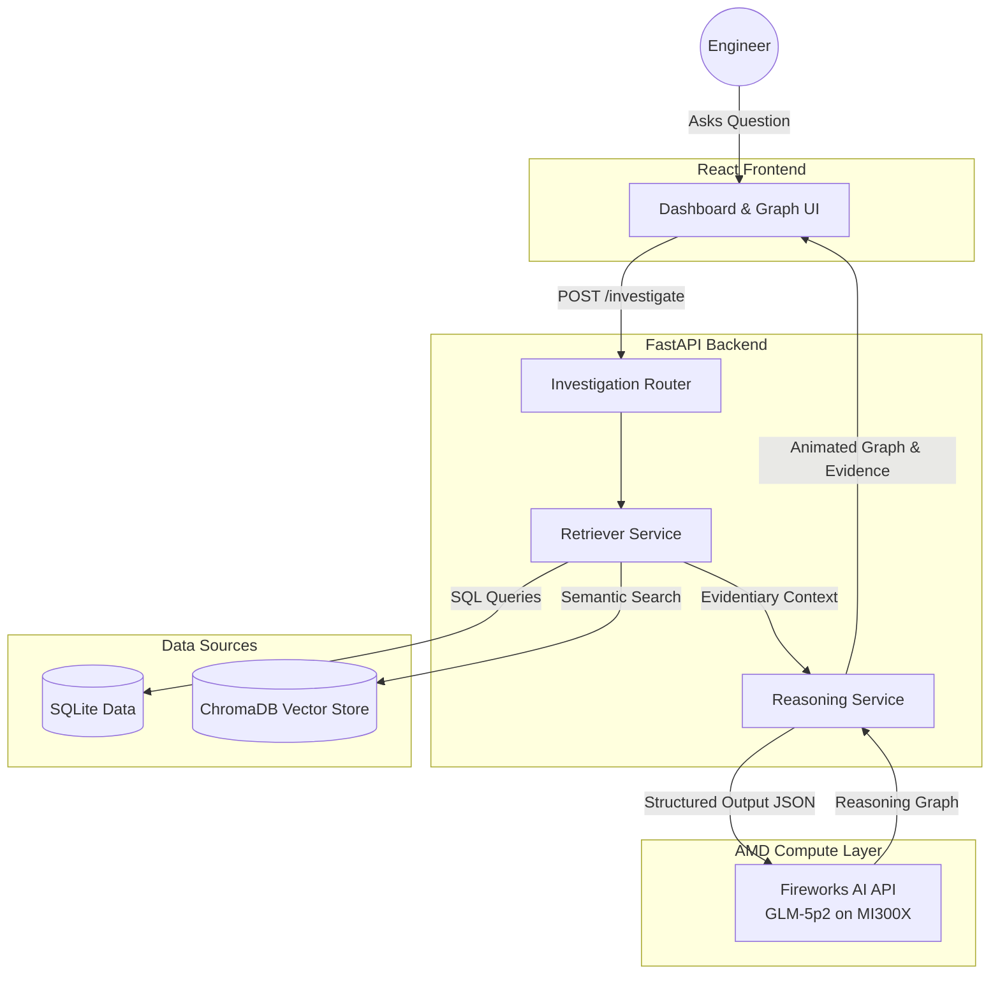
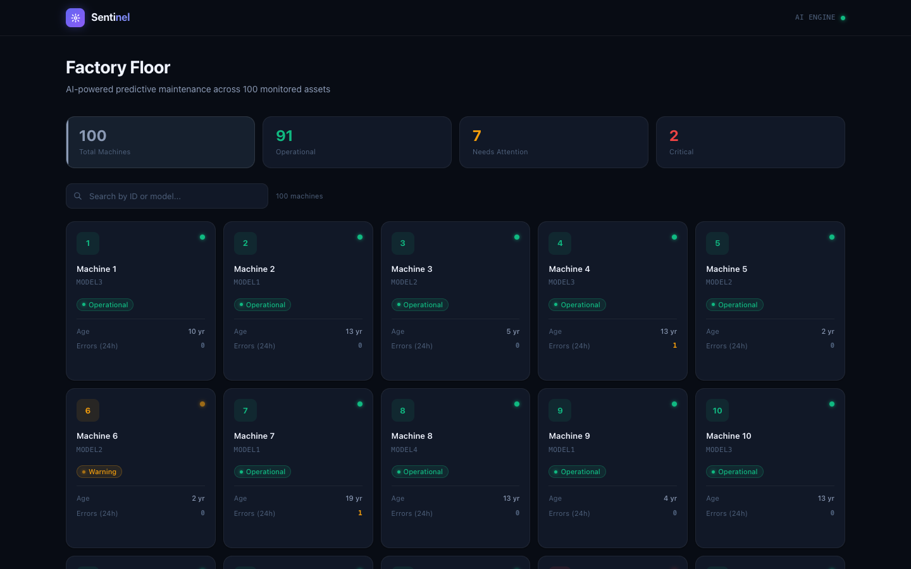
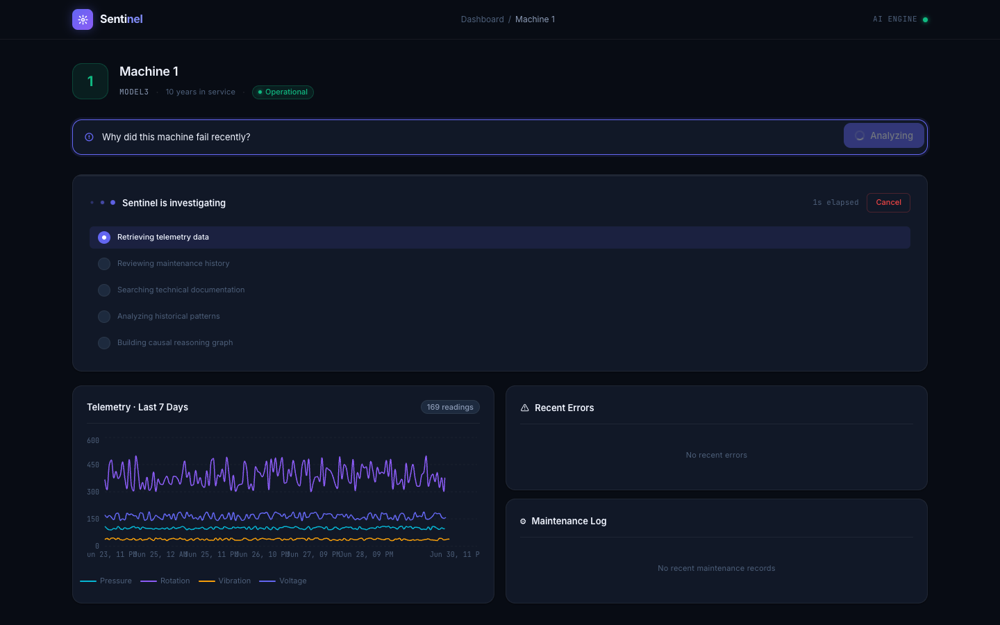
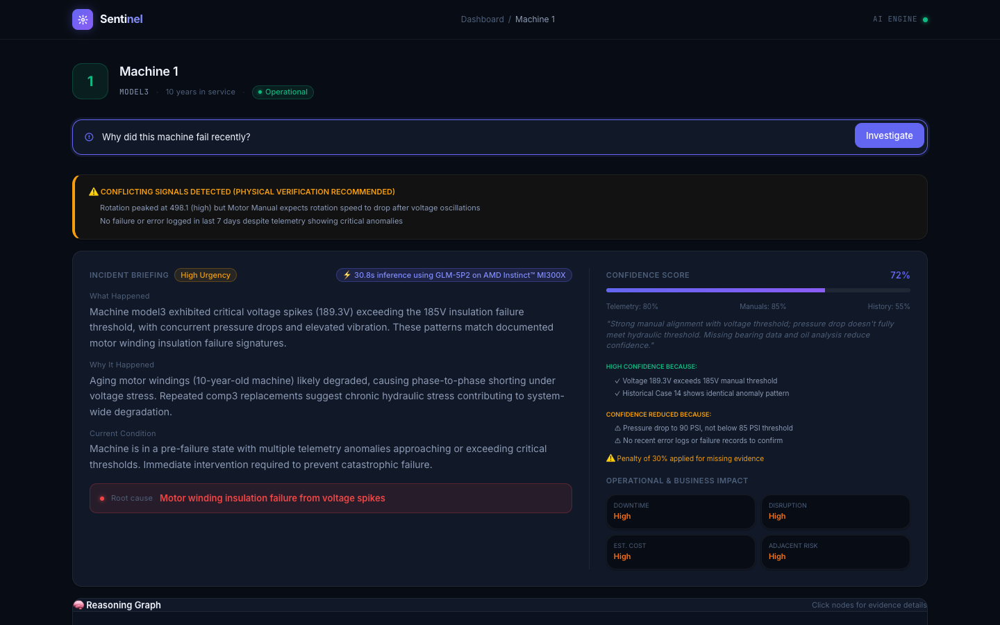
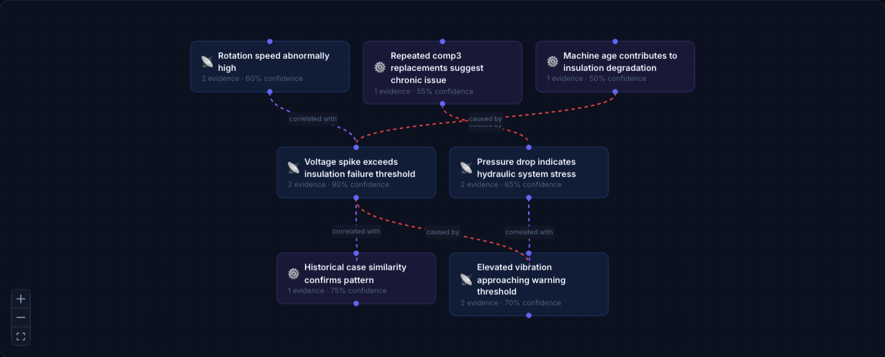
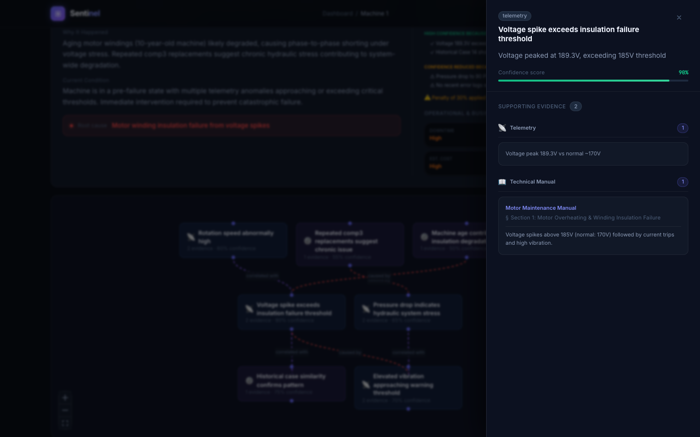
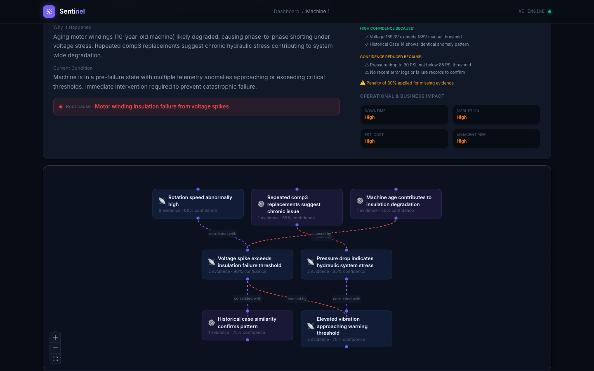

# Sentinel
> An AI reasoning engine for industrial investigations.


## The Problem
Today's factories collect enormous amounts of information: machine telemetry, sensor data, error logs, and maintenance records. But when a critical machine goes offline, engineers are forced to manually sift through these fragmented, siloed systems to figure out *why*. This leads to prolonged downtime and lost revenue.

## The Solution
**Sentinel** is an autonomous investigation engine that acts as a senior reliability engineer. When a machine fails, Sentinel ingests the fragmented evidence, retrieves relevant technical manuals using a local vector database, and uses advanced causal reasoning to build an **explainable reasoning graph**. 

Instead of generating a wall of text, Sentinel maps out the exact sequence of events (e.g., *Overdue Maintenance* → *Bearing Wear* → *Abnormal Vibration* → *Failure*) and cites specific telemetry spikes and manual sections for every deduction.

## Architecture

Sentinel is built for speed, privacy, and accuracy.



### Tech Stack
* **Frontend**: React, Vite, TailwindCSS, React Flow (for the visual graph), Recharts.
* **Backend**: FastAPI, SQLAlchemy.
* **Databases**: SQLite (for tabular telemetry/logs), ChromaDB (for vector search over manuals).
* **AI & Compute**: **Fireworks AI** running GLM-5p2, powered by **AMD Instinct™ MI300X accelerators**. We enforce strict JSON schema output to guarantee valid graph structures on every request.
 
## AMD Integration
This project was built specifically for the **AMD Developer Challenge**. We fulfill the AMD compute requirement by utilizing the **Fireworks AI API**, which serves open-source and proprietary models natively on AMD Instinct™ MI300X accelerators. By offloading our heavy multi-step causal reasoning to the highly capable **GLM-5p2** model via Fireworks, we achieve rapid inference times (~12-15 seconds for a complete multi-step report), directly demonstrating the raw throughput capabilities of AMD hardware.

## Running Locally

1. **Clone the repository**
```bash
git clone https://github.com/catnipconnoisseur/Sentinel.git
cd Sentinel
```

2. **Run with Docker Compose**
Ensure you have Docker installed and set your Fireworks API key:
```bash
export FIREWORKS_API_KEY=your_key_here
docker-compose up --build
```
*The app will be available at http://localhost*

## 🚀 Deployment

Sentinel is designed for a "one-click" deployment. The database and knowledge base automatically bootstrap themselves the first time the backend container starts.

### Local or VM Deployment (AMD Developer Cloud)

1. Clone the repository:
   ```bash
   git clone https://github.com/catnipconnoisseur/Sentinel.git
   cd Sentinel
   ```

2. Run the deployment script:
   ```bash
   ./deploy.sh
   ```
   *The script will prompt you for your `FIREWORKS_API_KEY` if it is not found in a `.env` file.*

3. Access the application at `http://localhost` (or your VM's IP address).

### Cloud Deployment (Railway)

We recommend [Railway](https://railway.app/) for a hassle-free public URL:

1. Connect your GitHub repository to Railway.
2. Railway will automatically detect the `docker-compose.yml` file and provision the `frontend` and `backend` services.
3. In the Railway dashboard, go to the **Variables** tab for the `backend` service and add:
   * `FIREWORKS_API_KEY=your_api_key_here`
4. Add a custom domain to the `frontend` service in Railway settings.
5. Deployment is complete! The first startup will take ~15 seconds extra as the AI indexes the factory manuals into ChromaDB.

## 📸 Screenshots

### Dashboard
Interactive grid list displaying live status metrics and historical failure profiles of all machinery.


### Machine Selection
Inspects historical work orders, active sensor alarms, and guides user query entry.


### AI Investigation Loading
Sentinel constructs contextual RAG bundles from raw database parameters and queries local manuals.


### AI Investigation
Sentinel generates dynamic incident reports, confidence explanations, and failure timelines.


### Reasoning Graph
Visualizes causal relationships between root causes, symptoms, and actions.


### Evidence Panel
Exposes exact technical manual excerpts, troubleshooting steps, and maintenance logs supporting every node.


### Engineering Report
Classifies recommendations by urgency, providing safety and performance justifications.


---

## 🚀 Live Demo
Access the live, publicly deployed instance of Sentinel at:
[Public Frontend URL](https://sentinel-production-9b3f.up.railway.app)

---

## 📁 Repository Structure
- `/backend`: FastAPI API server, SQLAlchemy model services, database bootstrappers, and embedding indexes.
- `/frontend`: Vite React dashboard, XYFlow node graphs, and responsive telemetry visualizers.
- `/docs/images`: Automated high-resolution pre-submission screens.
- `/submission`: Slide deck materials, script drafts, and pre-screening checklists.

---

## 📄 License
This project is licensed under the [MIT License](LICENSE).

