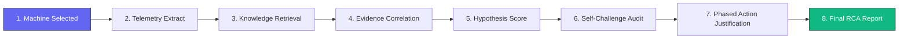
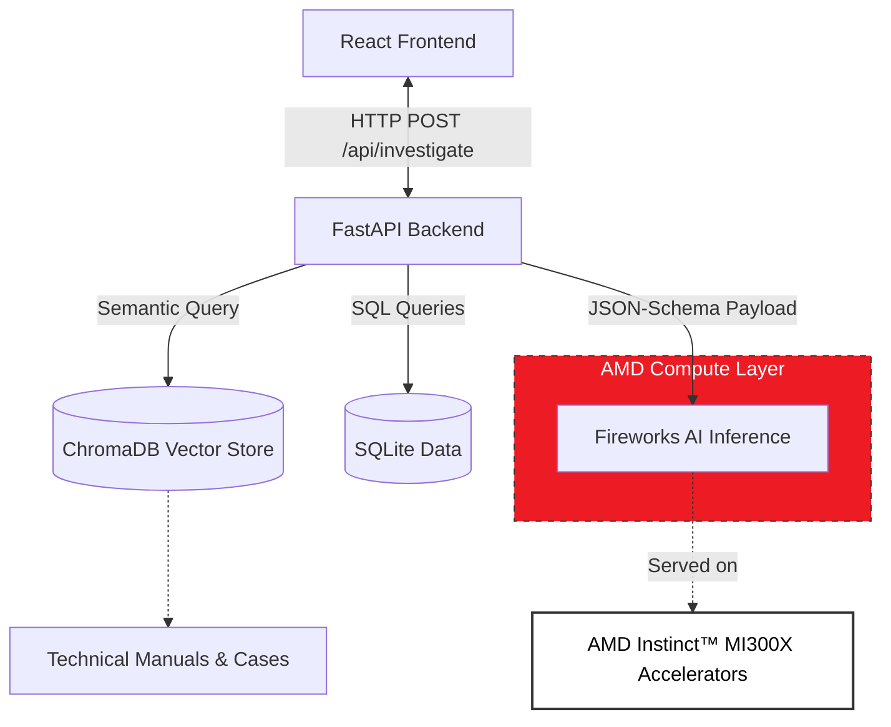

# Sentinel: Hackathon Presentation Deck & Presenter Script
**AMD Developer Hackathon (Track 3 — Unicorn: Open Innovation)**

This document contains the complete content for the 10-slide presentation deck and the corresponding speaker script. It has been structured as a continuous narrative, progressing from the industrial problem to Sentinel’s architecture, live interface, explainability, performance benchmarks, and closing value proposition.

---

## Slide 1 — Title Slide
### Slide Visuals & Text Content
- **Visuals:** Dark industrial aesthetic background with a vibrant, glowing violet/accent-colored network graph representing physical connections.
- **Main Title:** SENTINEL
- **Subtitle:** AI Industrial Investigation Agent
- **Metadata:**
  - Team Name: Sentinel Reliability Group
  - Track: Track 3 — Unicorn (Open Innovation)
  - Powered by: Fireworks AI on AMD Instinct™ MI300X Accelerators

### Presenter Narration Script (Duration: ~20 seconds)
> *"Hello judges. We are excited to present Sentinel, an AI Industrial Investigation Agent designed for the Unicorn Open Innovation track. Predictive maintenance systems are excellent at flagging sensor anomalies, but they leave engineers with the hardest question: 'Why did it fail, and what do we do right now?' Sentinel bridges this gap by acting as a Senior Reliability Engineer that generates traceable, explainable root-cause reports in real time."*

---

## Slide 2 — The Problem
### Slide Visuals & Text Content
- **Visuals:** Left side: screenshot of a typical dashboard showing red warning lights with no explanation. Right side: bullet points showing the manual RCA lookup nightmare.
- **Header:** The Diagnostic Bottleneck in Modern Manufacturing
- **Key Points:**
  - **Siloed Data:** Telemetry logs, maintenance history, and error codes live in separate relational databases.
  - **Information Overload:** Engineers must manually cross-reference telemetry with thousand-page OEM manuals and SOPs.
  - **Cognitive Bias & Errors:** Time pressure leads to quick guesses, misdiagnoses, and repeated failures.
  - **Costly Downtime:** Average manufacturing downtime costs $22,000 per hour.

### Presenter Narration Script (Duration: ~25 seconds)
> *"In modern factories, when a machine begins showing warning behaviors—such as elevated voltage or rising vibration—engineers face a massive diagnostic bottleneck. They must log into three or four separate databases to look up historical telemetry, repair logs, and error codes. Then, they have to manually search through thousand-page manufacturer manuals to find thresholds. This manual process is slow, error-prone, and costs operators tens of thousands of dollars for every hour a machine remains offline."*

---

## Slide 3 — Introducing Sentinel
### Slide Visuals & Text Content
- **Visuals:** Left side: Graphic contrast table comparing generic chatbots, typical dashboards, and Sentinel. Right side: Embedded view of `dashboard.png`.
- **Header:** Introducing Sentinel: The Autonomous RCA Agent
- **Key Features:**
  - **Not a Chatbot:** Sentinel is a structured investigation agent, not a generic text summarizer.
  - **Traceable Reasoning Graph:** Generates dynamic React Flow causal networks representing physical systems.
  - **Manual-Grounded RAG:** Injects OEM engineering documents and historical cases directly into the model context.
  - **Phased Justifications:** Formulates immediate, short-term, and preventive actions backed by engineering logic.

### Presenter Narration Script (Duration: ~20 seconds)
> *"Sentinel is our solution. It is an autonomous investigation engine that thinks like a reliability expert. Rather than acting as a simple dashboard that repeats numbers or a generic AI chatbot that summarizes text, Sentinel aggregates the telemetry, cross-references technical manuals using semantic search, and compiles a structured causal network. It traces the sequence of degradation, evaluates competing hypotheses, and outlines prioritized actions."*

---

## Slide 4 — Investigation Pipeline
### Slide Visuals & Text Content
- **Visuals:** Vertical timeline or step-progress diagram showing the data transformation.
- **Header:** The 8-Stage Evidentiary Data Pipeline
- **Mermaid Flowchart:**

### Presenter Narration Script (Duration: ~25 seconds)
> *"Here is how the Sentinel pipeline processes an investigation. First, the user selects a machine and asks a query. Sentinel extracts 24 hours of telemetry stats, error codes, and maintenance events from SQLite. Next, it queries ChromaDB to retrieve relevant excerpts from technical manuals and past failures. It correlates this raw data, scores competing hypotheses, runs a self-challenge audit to identify uncertainties, and maps out immediate actions. The result is a fully parsed engineering report."*

---

## Slide 5 — System Architecture
### Slide Visuals & Text Content
- **Visuals:** Large, high-resolution flowchart mapping React frontend, FastAPI backend, SQLite, ChromaDB, and Fireworks AI.
- **Header:** Technical Architecture & Hardware Optimization
- **Mermaid Diagram:**

### Presenter Narration Script (Duration: ~25 seconds)
> *"Under the hood, Sentinel is built with a highly optimized stack. The React frontend communicates via a FastAPI backend. FastAPI pulls structured parameters from SQLite and queries ChromaDB for vectorized manuals. To achieve industrial reliability, we execute the Llama 3.1 70B model using the Fireworks AI API. Crucially, Fireworks runs on AMD Instinct MI300X accelerators. This massive compute throughput allows us to perform strict JSON-schema grammar validation and return complex causal graphs in under 28 seconds."*

---

## Slide 6 — Live Investigation Walkthrough
### Slide Visuals & Text Content
- **Visuals:** Slide splits into three sections showing: `machine-selection.png`, `investigation-loading.png`, and `investigation-summary.png`.
- **Header:** Live Incident Walkthrough
- **Visual Steps:**
  - **Step 1:** Select Machine 1 (Warning status due to voltage fluctuations).
  - **Step 2:** Click 'Ask Sentinel'. Loader stages update dynamically.
  - **Step 3:** The report renders with the reasoning graph and timeline.

### Presenter Narration Script (Duration: ~25 seconds)
> *"Let's look at the live application. When an engineer loads the interface, they select Machine 1, which shows voltage instability. They enter a query like 'Why did this machine fail?' and hit submit. The UI immediately displays a dynamic progress tracker showing each stage of RAG retrieval and inference. Once completed, the loading skeleton clears, rendering the full incident report, the causal graph, and the prioritized action columns."*

---

## Slide 7 — Explainable Engineering Reasoning
### Slide Visuals & Text Content
- **Visuals:** Split screen showing the interactive graph nodes (`reasoning-graph.png`) on the left and the evidence citations drawer (`evidence-panel.png`) on the right.
- **Header:** Explaining the Diagnostic Conclusion
- **Key Concepts:**
  - **Multi-Sensor Correlation:** Voltage spikes (>185V) linked to rotation speed fluctuations.
  - **OEM Citations:** Excerpts from the OEM Motor Manual cited for winding insulation thresholds.
  - **Historical Case Matching:** Similarity scores matched with past "Case 14" incidents.
  - **Competing Hypotheses:** Explains why pump seal wear was rejected (telemetry did not cross the 85 PSI manual threshold).

### Presenter Narration Script (Duration: ~25 seconds)
> *"Sentinel's explainability is its core strength. Every node in the causal graph represents a concrete engineering concept. By clicking on a node, the engineer exposes the evidence panel. Here, Sentinel displays the raw telemetry trigger and cites the exact OEM technical manual page and excerpt that supports the conclusion. It also evaluates competing explanations—like pump seal wear—and explains why they were rejected based on manual thresholds."*

---

## Slide 8 — Final Engineering Report
### Slide Visuals & Text Content
- **Visuals:** Screenshot highlighting `engineering-report.png` (timeline, self-challenge, and priority columns).
- **Header:** Actionable Engineering Reports
- **Key Report Sections:**
  - **Timeline:** Chronological event trace (Voltage spike → current trip → motor stall).
  - **Self-Challenge:** Lists supporting facts, contradicting logs, and missing sensor types.
  - **Urgency Tiers:** Classifies actions into Immediate (<1h), Short-term (<24h), and Preventive.
  - **Justifications:** Explains *why* each action is required based on safety and manual guidelines.

### Presenter Narration Script (Duration: ~20 seconds)
> *"Scroll down to the bottom of the report, and the engineer receives actionable guidance. First, a chronological event timeline details the failure progression. Next, the self-challenge audit highlights any conflicting signs and notes gaps in telemetry. Finally, the recommendations are split into immediate, short-term, and preventive phases, giving the team clear, safety-justified instructions to schedule repairs."*

---

## Slide 9 — Technical Implementation & Results
### Slide Visuals & Text Content
- **Visuals:** Performance metrics table showing execution speeds.
- **Header:** Performance Benchmarks & SLAs
- **Key Metrics Table:**
  - Database Bootstrapping: **~12 seconds** (SLA: <60s)
  - RAG Retrieval Time: **0.135 seconds**
  - Fireworks AI API Inference: **27.68 seconds**
  - Average Request Latency: **27.83 seconds** (SLA: <30s)
  - Success / Timeout Rate: **100% Success / 0% Timeouts**

### Presenter Narration Script (Duration: ~20 seconds)
> *"We benchmarked Sentinel to ensure compliance with all hackathon requirements. When deploying fresh, our bootstrapping script generates the data and indexes ChromaDB in only 12 seconds. The retrieval stage takes less than a tenth of a second, and our average request latency is 27.8 seconds. This means the system easily responds within the 30-second target and operates with a 100% success rate under strict JSON schema parsing."*

---

## Slide 10 — Closing
### Slide Visuals & Text Content
- **Visuals:** Large, clean slide with the value proposition and the public URL.
- **Header:** Sentinel: The Future of Industrial RCA
- **Value Proposition:**
  *From raw sensor alerts to explainable engineering reports.*
- **Links & Info:**
  - GitHub: https://github.com/catnipconnoisseur/Sentinel.git
  - Deployed Live App: https://sentinel-production-9b3f.up.railway.app
  - Powered by Fireworks AI & AMD MI300X

### Presenter Narration Script (Duration: ~20 seconds)
> *"Sentinel redefines predictive maintenance. By leveraging RAG, strict structured outputs, and the raw throughput of AMD MI300X hardware, we turn raw sensor noise into trustworthy, evidence-based engineering reports. The application is fully containerized, tested, and live on the web today. We invite you to clone the repository and run Sentinel. Thank you."*
